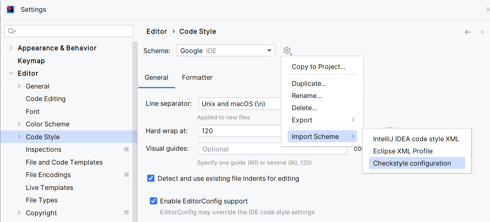
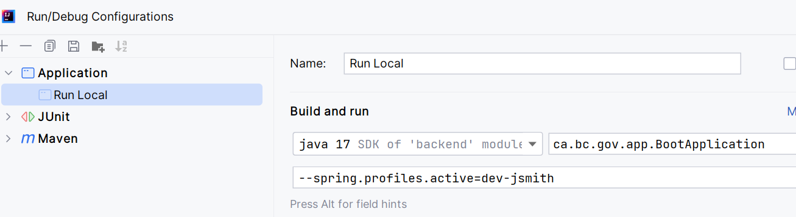
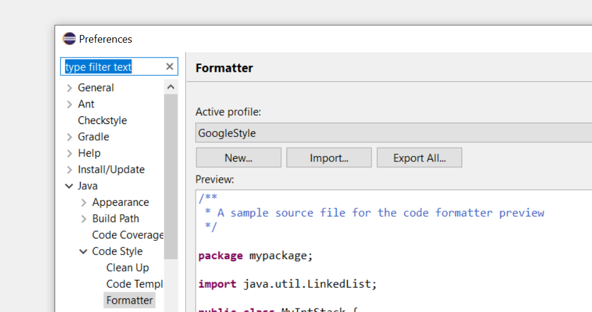
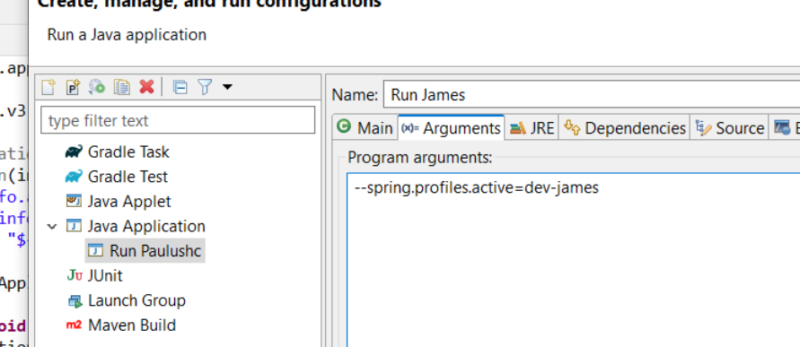
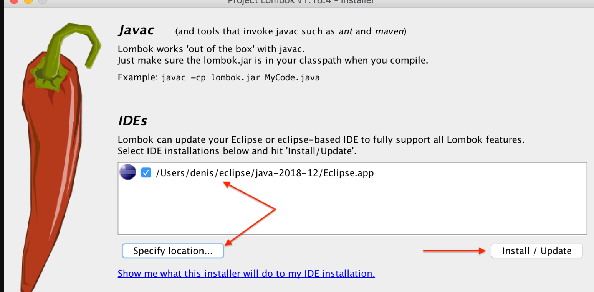

<!-- PROJECT SHIELDS -->

The nr-forest-client-api application provides the API that allows systems to consume forest client data without having to connect to a database. We are working the process to publish our API  

The nr-forest-client-api is a Java application, integrated with the [greenfield-template](https://github.com/bcgov/greenfield-template) to automate the process for testing, security scanning, code quality checking, image building and deploying. It is hosted in openshift, protected and published through [API Services Portal](https://api.gov.bc.ca/)

## Configuring IntelliJ Code Style

You will find a copy of the [google code style](docs/google_checks.xml) inside our [docs](docs) folder.

On the settings screen, add the checks as the following image:

## Configuring IntelliJ Run Configuration

To set your profile on IntelliJ, just run the
[application main class](src/main/java/ca/bc/gov/app/BootApplication.java)
and edit the configuration as the following image.

## Configuring Eclipse Code Style

You will find a copy of the [google code style](docs/eclipse-java-google-style.xml) inside our [docs](docs) folder.

On the window > preferences screen, go to Java > Code Style > Formatter,
import the xml file and keep **GoogleStyle** selected as the following image:

## Configuring Eclipse Run Configuration

To set your profile on Eclipse, just run the
[application main class](src/main/java/ca/bc/gov/app/LegacyApplication.java)
and edit the configuration as the following images.

## Setting up Lombok on Eclipse

If you're running eclipse, you will need to manually install lombok in order for it to work.
The easiest way of doing that is by running any mavem command that would trigger the download of the lib, such as
`mvn clean compile`.

Once it's done, navigate to your repository folder (its usually inside your user folder, called *.m2/repository*)
and look the latest version of lombok (inside org/projectlombok/lombok/) and run the lombok jar,
like `java -jar lombok-X.Y.Z.jar`.

A screen will pop up, listing all the possible IDEs, select yours and install/update it. Once it's done,
restart eclipse.
